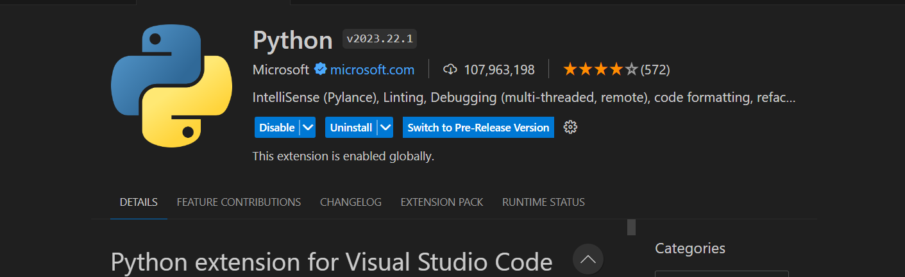
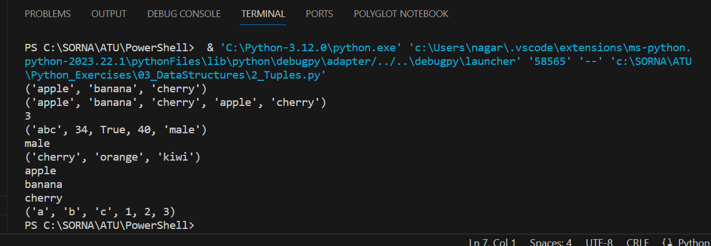

# Overview

Python is a popular programming language known for its simplicity and readability. It is widely used in various domains such as web development, data analysis, artificial intelligence, and more. Python emphasizes code readability, which makes it easier to understand and maintain.

This Excersise list various programs from a begineer to advance level programs.All the Python programs listed here can be executed independently and does not has any dependency on other module except few of them.Python has a vast ecosystem of third party libraries and frameworks.Top row of each program describes purpose of the program.

## Programming Language:

+ Python 3.12.0
  
 ## Python packages and libraries Used:

+ datetime
+ math
+ os
+ pylint
+ socket
+ udp
+ sys
+ csv 

## Prerequisites

+ Modern Operating System:
+ x86 64-bit CPU (Intel / AMD architecture). ARM CPUs are not supported.
+ 4 GB RAM.
+ 5 GB free disk space.
  
  
## Installation

+ Visual Studio Code IDE used to manage project and different Python program.To run Python from the Visual Studio Code navigate to Extensions and search -> Python-> Select version v2023.22.1 by Microsoft and install
  

## Usage

1. Each ".py" file has no dependency on other".py" program (except for some)
2. .py files can be easily debug using a in built debugger for VSC.User can also watch variables in run time and analyse results
   
   
## Configuration
Extract the zip project in C:\Python_Execrcises folder.Open Visual Studio code and select File-> Add  Folder to Workspace.Windows Browse folder window will pop up.Select the folder and click Add.Project folder will be successfully added to workspace

## Example

  

## Source Code file name

1. 01_Basic_Programming
2. 02_String_Manipulation
3. 03_DataStructures
4. 04_Loops_And_Statements
5. 05_Functions
6. 06_Modules
7. 07_Errors
8. 08_OOPS_Concepts
9. 09_Tests
10. 10_Logging_And_Time
11. 11_Network_Utilities
12. 12_Path
   

# License
This is open source code and free distributable.All the programs can be downloaded from my following publc git repository.
URI